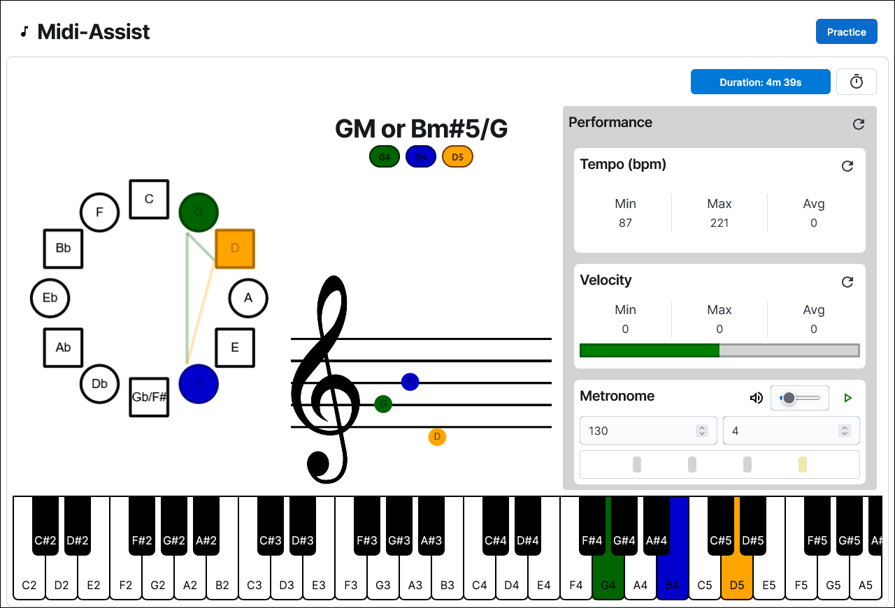

# Overview
A midi visualizer for piano

### Inspriation 
- Kepiano: https://x.com/kepano/status/1884672012292923580/video/1

## Dependencies
- React 
- MUI Joy
- Web Midi
- Tonal

# Todo
### Fixes
- Practice: 
    - Accurate detection of tempo
    - Get velocity of multiple notes being held simultaneously
    - Add lines for notes outside of bar in chord viewer or implement existing library
    - Clef doesnt appear on page refresh/load
    - Stack CoF and scale display over each other when window width < window hieght
    - Show all notes faded out on scale display under chord, highlight when notes are pressed. Stack like keys on piano. Ignore octaves
    - Metronome highlights not showing up on iOS
    - Add Sustain input
### Future
- General
    - Onscreen Virtual Keyboard (Controllable on PC Keyboard)
    - Save data to browser/server
    - Use Notes type/class from 'tonal' library
- Practice
    - ~~Session Duration: Pause, Reset, Start Countdown Timer~~ [DONE]
    - ~~Chord Viewer~~ [DONE]
    - ~~Circle of Fifths Viewer~~ [DONE]
    - ~~Metrinome~~ [DONE]
    - ~~Basic/Intermediate/Advanced Panel View (Tap/Click to Change Size)~~ [IGNORE]
    - ~~Long Press to reset individual panels~~ [IGNORE]
- Drills: 
    - Create, play, edit and delete drills
    - Display stats at the end of the exercise
- SightReading: 
    - Sightreading trainer
- Settings
    - View Connected Midi Device
    - Select Target Midi Device
    - UI Themeing
### Brainstorming
- Display when Midi Device is connected or removed
- ~~iOS Support through WebMidi App~~ [DONE]